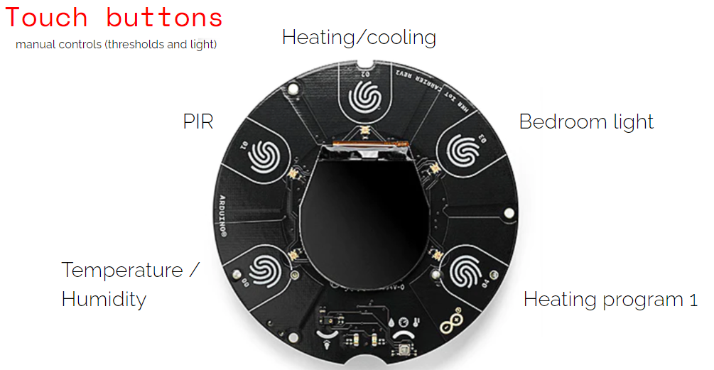
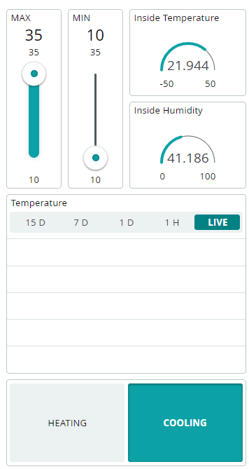
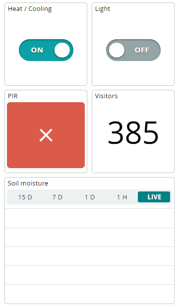

# Explore IoT kit - rev2 - Demo

## 1 Setup
### 1.1 Installation LOCAL mode (no internet)

 1. Download this repo
 2. Open with the arduino IDE the .ino file inside the folder VOLCANO_sust_home_LOCAL_v2
 3. Try to compile the sketch and see if you need to install some libraries
 4. Upload the sketch on the board (MKR 1010 wifi)

### 1.2 Installation CLOUD mode (with internet)

 1. Download this repo
 2. Open with the arduino IDE the .ino file inside the folder VOLCANO_sust_home_CLOUD_v2
 3. The IDE will open automatically all the file in the folder, from the IDE look for the file called "arduino_secrets.h"
 4. Change the SSID and the PASSWORD
 5. Try to compile the sketch and see if you need to install some libraries
 6. Upload the sketch on the board (MKR 1010 wifi)

## 2 How To

### 2.1 LOCAL

In the local mode use the Buttons to activate the boards features or read the sensors values:


 - 00: Sensors Values: read in sequence the 3 environmental sensors: Temperature, Humidity, Soil mosture
 - 01: PIR: read how many visitors have triggered the pir sensors
 - 02: Heating/Cooling: switch between the heating mode
 - 03: Bedroom light: switch on or switch off the bedroom light
 - 04: Heating program 1: switch on or switch off the heating or cooling actuator (stripled for the demo)

### 2.2 CLOUD

In the cloud mode you can still controll the board with the buttons (in a less reactive way..) and you can control with the app IoT Remote:
 


#### VERY IMPORTANT

The app simulate a thermostat, if you want to manual control the heating or cooling you have to place the MAX THRESHOLD SLIDER to 35 (the maximum) and the MIN THRESHOLD SLIDER to 10 (the minimum).
**If you move any of them to other position you start the AUTOMATIC MODE**:

In the automatic mode the threshold slider control the actuators (heating or cooling) not the buttons. You can still use the buttons but the program will override it in 1 seconds.

#### RESET THE VISITORS COUNTER
To reset the visitors counter you need to **change the file name** in the first line of code of the "VOLCANO_sust_home_CLOUD_v2.ino" file. For example:

from ```#define FILE_VISITORS_NAME "test3.txt"```

to ```#define FILE_VISITORS_NAME "test4.txt"```


